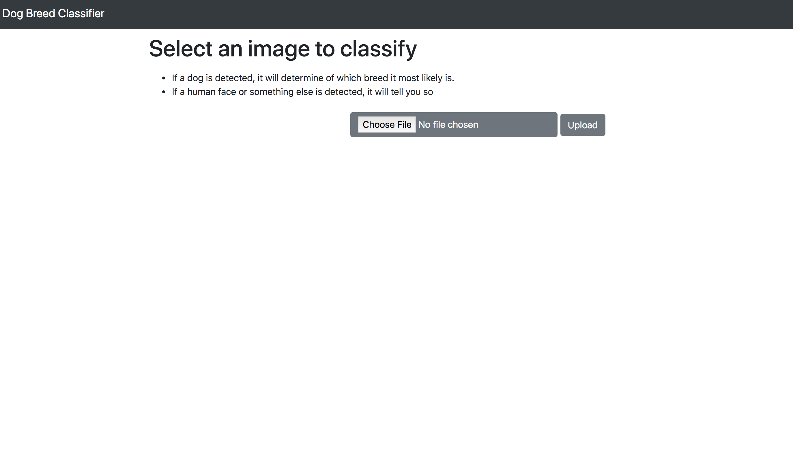
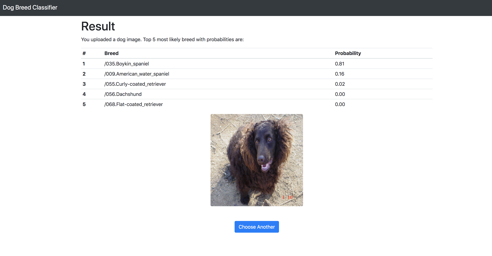

# Dog Breed Classifier using Convolutional Neural Networks
Data Science Nanodegree project on building a dog breed image classifier with keras.

## Overview 
This project is part of Udacity's Data Science Nanodegree program. 
The aim of this project is to create a robust CNN model for detecting dog breeds based on the given image.

I have created a web application using Flask that is able to identify a breed of dog if given an image as input. 
The web application gives top 5 results based on the probability of dog belonging to a certain breed.
If the image contains a human face, then the application will say that its a human.

Final model for identifying dog breeds achieved around 83% accuracy level on the test dataset.


## Project Motivation
The reason I chose this capstone project is because I am currently working on a lane detection algorithms 
using opencv and this project gave a great boost in understanding different image processing, ImageNet dataset, and of 
course Convolutional neural nets and different types of training it.

This project allowed me to explore state-of-the-art CNN models for classification and helped me understand the 
nuances of building a CNN from scratch as well as using transfer learning. 


## Data 
The training data for this project is located [here](https://s3-us-west-1.amazonaws.com/udacity-aind/dog-project/dogImages.zip). 
This dataset contains 133 different breeds of dogs and is already split into train, test, and validation sets. 

## General Dependancies 

* Flask==1.0.2
* Flask-Cors==3.0.7
* Jinja2==2.10

* Keras==2.0.2
* Keras-Applications==1.0.7
* Keras-Preprocessing==1.0.9

* numpy==1.14.4
* opencv-python==4.1.0.25
* pandas==0.24.2

* python-dateutil==2.8.0
* scipy==1.1.0

* tensorflow==1.13.1
* tensorflow-estimator==1.13.0
* Theano==1.0.2

Please take a look at `requirement.txt` file for more detailed list

## Instructions to run the web application

The Convolutional Neural Network is trained on 133 different dog breeds: 

* If a dog image is selected: 
    * Determine top 5 dog breed it most likely is based on probabilities. 
* If a human face image is selected: 
    * It displays that the chosen image is of human
* If neither a dog or human face detected it asks to choose another image





## Steps to run the web app

1. Clone the repository.
```	
https://github.com/npalaska/CNN_Dog_Breed_Classifier.git
cd dog-breed-classifier
```

2. Create and activate a new virtual environment.
```
python3 -m virtualenv cnn
source cnn/bin/activate
```

3. Download the dependencies using pip.
```
pip install -r Requirements.txt
```

4. Start the app locally 

```
python dog-project.py
```

## Overview of dog_app jupyter notebook

The exploration of the state of the art CNN models for dog breed detection/classification happened in following 
steps:
* Step 0: Import Datasets
* Step 1: Detect Humans
    * We used OpenCV's implementation of Haar feature-based cascade classifiers to detect humans

* Step 2: Detect Dog using ImageNet
    * We used a pre-trained ResNet-50 model to detect dogs in images. 
    the model has been trained on ImageNet, a very large, dataset used for image classification and other computer 
    vision tasks
    
* Step 3: Pre-processing the imported data that can be used by the CNN models built by the Keras
    * When using TensorFlow as backend, Keras CNNs require a 4D array as input (tensors), with shape 
    (nb_samples,rows,columns,channels)
    * Where nb_samples corresponds to the total number of images, and rows, columns, and channels correspond to the 
    number of rows, columns, and channels for each image, respectively.
    
* Step 3: Create a CNN to Classify Dog Breeds (from Scratch)
    * I used multiple 2D convolutional layers with first layer having an input shape =(224, 224, 3) which is a size 
    of an individual image in our dataset.
    * I used the `relu` activation function and dropout rate of 40% on all the layers except the output layer.
    * On the output layer I have used the `softmax` activation function  
    * The accuracy I got is around 11%
    * I have also experimented using data augmentation to see if it helps improve the accuracy, however data 
    augmentation only assisted with reducing the loss function values but did not helped in improving the accuracy
    itself.
   
* Step 4: Create a CNN to Classify Dog Breeds (using Transfer Learning)
    * To improve the accuracy I experimented with multiple bottleneck features such as VGG16, Inception and Xception, 
    however, I found out that bottleneck features from Xception greatly improves our accuracy to around 83%
    * I have pre-trained the model and already saved the model weights in `saved_models` folder for later use 
    in the web application
    

* Step 5: Written an algorithm for dog breed classification

* Step 6: Algorithm testing

## Acknowledgements
This dataset is provided by Udacity and this work is done under Udacity guidelines as a part of data science capstone 
project.